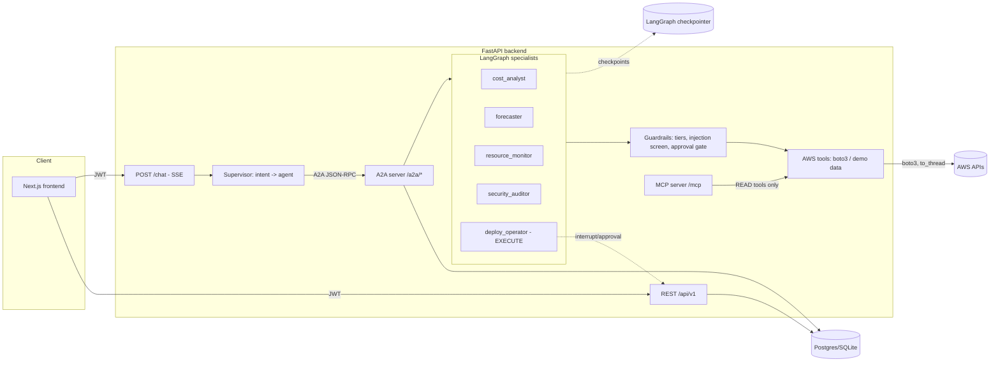

# CloudLens Backend

"Claude Code for your cloud." FastAPI + LangGraph multi-agent backend: cost analysis,
resource inventory, security auditing, and approval-gated deploy actions over AWS.

## Architecture



Guardrail #1 (EXECUTE tools never run directly) is enforced in one place -
`app/agents/graph.py`'s shared `build_tool_agent` - so every specialist gets it
for free instead of re-implementing it per agent.

## Setup

```bash
cd backend
python -m venv .venv
.venv/Scripts/python.exe -m pip install -r requirements-dev.txt   # includes pytest
cp .env.example .env   # fill in SECRET_KEY, ENCRYPTION_KEY, GROQ_API_KEY

# generate a Fernet key for ENCRYPTION_KEY:
.venv/Scripts/python.exe -c "from cryptography.fernet import Fernet; print(Fernet.generate_key().decode())"

.venv/Scripts/python.exe -m pytest -q
.venv/Scripts/python.exe -m uvicorn app.main:app --reload
```

No `DATABASE_URL` -> SQLite file (`cloudlens.db`) + local LangGraph SQLite
checkpointer (`.langgraph_checkpoints.db`). Set `DATABASE_URL` (Neon/Supabase
Postgres, `postgres://...`) for production - both the app DB and the LangGraph
checkpointer switch to Postgres automatically.

No AWS credentials stored for a user -> **demo mode**: deterministic fake EC2/S3/RDS/Lambda
inventory, 90 days of cost history with trend + weekly seasonality, and 2 IAM findings.
Every response carries `"demo": true` in that case. The whole product is usable with zero
AWS account.

## Env vars

| Var | Required | Default | Notes |
|---|---|---|---|
| `SECRET_KEY` | yes | - | JWT HS256 signing key, 32+ bytes |
| `ENCRYPTION_KEY` | yes | - | Fernet key for AWS credential encryption at rest |
| `DATABASE_URL` | no | unset -> SQLite | `postgres://...` for Neon/Supabase; normalized to `asyncpg`/`psycopg` internally |
| `GROQ_API_KEY` | no* | unset -> FakeLLM (tests only) | Primary LLM provider |
| `GROQ_MODEL` | no | `openai/gpt-oss-120b` | Groq-hosted model |
| `AZURE_OPENAI_API_KEY` | no | unset | Enables 429/5xx fallback |
| `AZURE_OPENAI_ENDPOINT` | no | unset | Required if using Azure fallback |
| `AZURE_OPENAI_DEPLOYMENT` | no | `gpt-4.1-mini` | Azure deployment name |
| `FRONTEND_ORIGIN` | yes | `http://localhost:3000` | Locks CORS |
| `DEMO_SEED` | no | `42` | Deterministic demo-data seed |

\* Without `GROQ_API_KEY`, `/chat` and the A2A routes fall back to a stub LLM that never
calls out to any provider - fine for exercising REST endpoints, not useful for real chat.

## IAM policy (read-only, recommended default)

Attach to the IAM user whose keys you paste into `PUT /credentials`:

```json
{
  "Version": "2012-10-17",
  "Statement": [
    { "Effect": "Allow", "Action": "ce:Get*", "Resource": "*" },
    {
      "Effect": "Allow",
      "Action": [
        "ec2:Describe*",
        "s3:GetBucket*",
        "s3:ListBucket*",
        "s3:ListAllMyBuckets",
        "rds:Describe*",
        "lambda:List*",
        "lambda:Get*",
        "cloudwatch:GetMetricStatistics",
        "cloudwatch:ListMetrics",
        "iam:GetAccountAuthorizationDetails",
        "iam:ListUsers",
        "iam:ListAccessKeys",
        "iam:GetAccessKeyLastUsed",
        "iam:ListMFADevices",
        "autoscaling:Describe*",
        "tag:GetResources"
      ],
      "Resource": "*"
    }
  ]
}
```

EXECUTE actions (`start_ec2`, `stop_ec2`, `scale_asg`) additionally need a separate,
explicitly opted-in policy statement (e.g. `ec2:StartInstances`, `ec2:StopInstances`,
`autoscaling:SetDesiredCapacity`) - do not attach it by default.

## Guardrails

1. **Permission tiers** - `app/guardrails.py` tags every tool READ/PLAN/EXECUTE.
   EXECUTE tools pause the LangGraph run via `interrupt()` (see `app/agents/graph.py`)
   and create a DB `Approval` row (see `app/a2a/server.py`); `POST /approvals/{id}/decide`
   resumes the exact paused graph via `Command(resume=...)` against the same
   checkpointer thread.
2. Minimal read-only IAM by default (above); execute needs opt-in.
3. **Prompt-injection screen** - `app/guardrails.screen_text()`, regex heuristics,
   wraps (never drops) flagged input and logs an audit incident.
4. **Audit log** - every tool call and every prompt-injection flag writes an
   `AuditLog` row (secrets redacted), queryable via `GET /audit`.
5. **Auth** - JWT HS256, `passlib` pbkdf2_sha256 password hashing. Everything except
   `/auth/*`, `/healthz`, `/.well-known/*` requires `Authorization: Bearer <token>`.
6. **Credentials at rest** - Fernet-encrypted; API only ever returns last-4.
7. **Rate limiting** - slowapi: 5/min auth routes, 20/min `/chat`, 60/min elsewhere.
8. **CORS** - locked to `FRONTEND_ORIGIN`.
9. Max 8 agent-loop iterations per request (`guardrails.MAX_ITERATIONS`), per-request
   token budget cap (`guardrails.TOKEN_BUDGET`).

## Known simplifications (ponytail-marked in code)

- Supervisor intent routing is keyword-based, not an LLM call (`app/agents/supervisor.py`)
  - deterministic, free, and doesn't need a fake-LLM contract for routing tests.
- `/chat` streams step-level SSE events (`agent_started`, `tool_called`, `tool_result`,
  `message_delta`, `approval_required`, `done`); `message_delta` arrives as one chunk
  because A2A's `message/send` is a single blocking call, not itself a token stream.
- MCP tries the official `mcp` SDK's `FastMCP` first (confirmed working - see tests/boot
  log); falls back to a minimal hand-rolled `GET /mcp/` + `POST /mcp/call` JSON endpoint
  if the SDK mount fails in a given environment.
- Real (non-demo) `get_cost_by_tag`, `audit_iam_users`, and `find_open_security_groups`
  return empty results - the demo-mode versions are fully implemented and tested; wiring
  the real Cost Explorer tag grouping / IAM policy analysis / SG scan is straightforward
  follow-up using the same `ToolContext.boto3_session()` pattern as the other real-mode
  tools in `app/aws/tools.py`.

## Tests

```bash
.venv/Scripts/python.exe -m pytest -q
```

20 tests, demo mode, FakeLLM stub (`app/llm.py:FakeLLM`) - no real API calls. Covers
auth flow, credential encryption roundtrip, guardrail tier enforcement (EXECUTE tools
blocked without approval), prompt-injection screen, forecaster math, `/chat` SSE happy
path, and the full approval create -> approve/reject -> graph-resume flow over HTTP.
